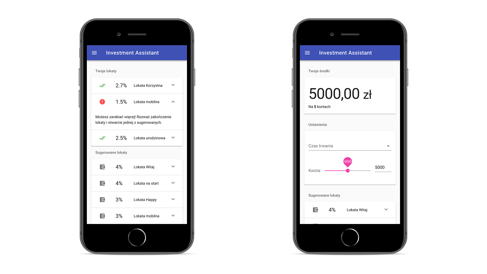

# Investment Assistant

Application suggesting the best investment options based on client's funds and previous decisions. The Assistant can also rate currently used investment options and suggest profitable changes. In this MVP, application works by suggesting web-scraped deposits with highest interest values.

This project was created in 12 hours at a FinTech hackathon. We were provided with existing web API allowing us to acquire customer information from different banks.

## Getting Started

These instructions will get you a copy of the project up and running on your local machine for development and testing purposes.

### Prerequisites

You need node.js to run the client application and python 3 and pip to run the server.

### Installing and running

To install and serve client application, see readme in the `client` folder: [client/README.md](client/README.md).

To install and run server-side application, see readme in the `server` folder: [server/README.md](server/README.md).

## Built With

* [Flask](http://flask.pocoo.org/) - The web framework used to create deposit suggestion API
* [BeautifulSoup](https://www.crummy.com/software/BeautifulSoup/bs4/doc/) - Web scraping
* [vue.js](https://vuejs.org/) - JS framework used to create frontend PWA application
* [vuetify](https://vuetifyjs.com/en/) - Material Design component framework for bue

## Authors

* **Kamila Kalecińska** - *Concept and initial work* - [kaamka](https://github.com/kaamka)
* **Karol Horosin** - *Concept and initial work* - [horosin](https://github.com/horosin)

## License

This project is licensed under the MIT License.

## Acknowledgments

* Thanks to [asseco](https://asseco.com) for organizing the hackathon this project was started on.
